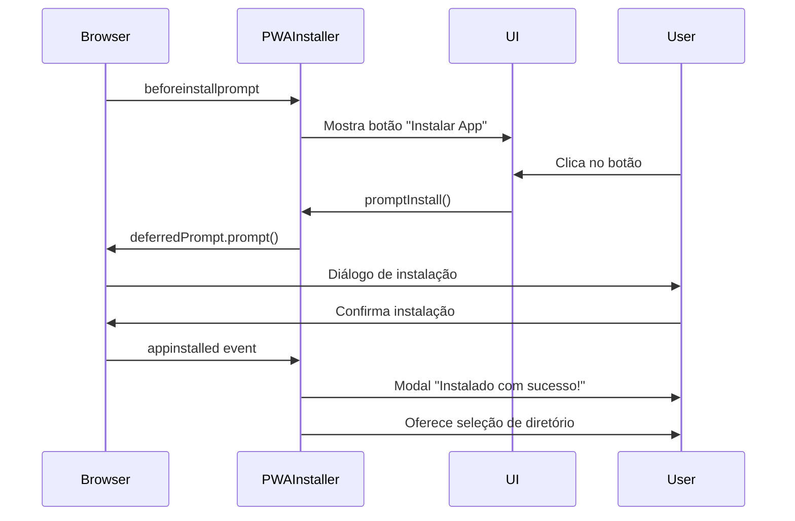

# 🔧 Terra MIDI PWA - Guia Técnico para Desenvolvedores

## 📋 Índice

1. [Arquitetura PWA](#arquitetura-pwa)
2. [Instalação Personalizada](#instalação-personalizada)
3. [File System Access API](#file-system-access-api)
4. [Armazenamento Persistente](#armazenamento-persistente)
5. [Service Worker Otimizado](#service-worker-otimizado)
6. [Segurança e Boas Práticas](#segurança-e-boas-práticas)
7. [Compatibilidade de Navegadores](#compatibilidade-de-navegadores)
8. [Testes e Validação](#testes-e-validação)

---

## 🏗️ Arquitetura PWA

### **Componentes Principais**

```
Terra_Midi/
├── manifest.json          # Manifesto PWA
├── sw.js                  # Service Worker
├── index.html            # App Shell
├── js/
│   ├── pwaInstaller.js   # Gerenciador de instalação
│   └── serviceWorkerBridge.js  # Ponte SW ↔ App
└── css/
    └── pwa-installer.css # Estilos dos componentes
```

### **Fluxo de Instalação**



---

## 📲 Instalação Personalizada

### **1. Captura do beforeinstallprompt**

```javascript
// js/pwaInstaller.js

bindInstallPrompt() {
    window.addEventListener('beforeinstallprompt', (e) => {
        // Prevenir mini-infobar do Chrome
        e.preventDefault();
        
        // Armazenar evento para usar depois
        this.deferredPrompt = e;
        
        // Mostrar botão customizado
        this.showInstallButton();
    });
}
```

### **2. Trigger Manual de Instalação**

```javascript
async promptInstall() {
    if (!this.deferredPrompt) {
        this.showInstallInstructions();
        return;
    }
    
    // Mostrar feedback visual
    this.showInstallModal('installing');
    
    // Exibir prompt nativo
    this.deferredPrompt.prompt();
    
    // Aguardar resposta do usuário
    const { outcome } = await this.deferredPrompt.userChoice;
    
    if (outcome === 'accepted') {
        this.showInstallModal('success');
        this.offerDirectorySelection();
    } else {
        this.showInstallModal('cancelled');
    }
    
    this.deferredPrompt = null;
}
```

### **3. Detecção de Instalação**

```javascript
bindInstallationDetection() {
    window.addEventListener('appinstalled', (e) => {
        console.log('✅ PWA instalado!');
        
        this.isInstalled = true;
        this.hideInstallButton();
        this.showInstallSuccessMessage();
        
        // Analytics
        if (typeof gtag !== 'undefined') {
            gtag('event', 'pwa_installed');
        }
    });
}
```

---

## 📂 File System Access API

### **Seleção de Diretório**

```javascript
async selectInstallDirectory() {
    // Verificar suporte
    if (!('showDirectoryPicker' in window)) {
        console.warn('File System Access API não suportada');
        return null;
    }
    
    try {
        // Solicitar acesso ao diretório
        this.directoryHandle = await window.showDirectoryPicker({
            mode: 'readwrite',
            startIn: 'documents'
        });
        
        // Salvar no IndexedDB
        await this.saveDirectoryHandle();
        
        // Criar estrutura de pastas
        await this.createDirectoryStructure();
        
        return this.directoryHandle;
        
    } catch (error) {
        if (error.name === 'AbortError') {
            console.log('Usuário cancelou');
        } else {
            console.error('Erro:', error);
        }
        return null;
    }
}
```

### **Estrutura de Pastas**

```javascript
async createDirectoryStructure() {
    const folders = ['soundfonts', 'presets', 'recordings', 'cache'];
    
    for (const folder of folders) {
        await this.directoryHandle.getDirectoryHandle(folder, { 
            create: true 
        });
    }
    
    // Criar metadados
    const metaFile = await this.directoryHandle.getFileHandle(
        'terra-midi-metadata.json', 
        { create: true }
    );
    
    const writable = await metaFile.createWritable();
    await writable.write(JSON.stringify({
        version: '1.0',
        createdAt: new Date().toISOString(),
        folders: folders
    }, null, 2));
    await writable.close();
}
```

### **Persistência do DirectoryHandle**

```javascript
async saveDirectoryHandle() {
    const db = await this.openIndexedDB();
    const tx = db.transaction('settings', 'readwrite');
    const store = tx.objectStore('settings');
    
    await store.put({
        key: 'directoryHandle',
        value: this.directoryHandle
    });
}

async checkSavedDirectory() {
    const db = await this.openIndexedDB();
    const tx = db.transaction('settings', 'readonly');
    const store = tx.objectStore('settings');
    const result = await store.get('directoryHandle');
    
    if (result?.value) {
        this.directoryHandle = result.value;
        
        // Revalidar permissão
        const permission = await this.directoryHandle.queryPermission({
            mode: 'readwrite'
        });
        
        if (permission === 'granted') {
            return this.directoryHandle;
        } else if (permission === 'prompt') {
            await this.directoryHandle.requestPermission({
                mode: 'readwrite'
            });
        }
    }
    
    return null;
}
```

---

## 💾 Armazenamento Persistente

### **Solicitação de Persistência**

```javascript
async requestStoragePersistence() {
    if (!navigator.storage?.persist) {
        console.warn('Storage Persistence API não suportada');
        return;
    }
    
    // Verificar se já é persistente
    const isPersisted = await navigator.storage.persisted();
    
    if (isPersisted) {
        console.log('✅ Storage já é persistente');
        return;
    }
    
    // Solicitar persistência
    const granted = await navigator.storage.persist();
    
    if (granted) {
        console.log('✅ Persistência concedida!');
        this.showToast('✅ Armazenamento seguro ativado', 'success');
    } else {
        console.warn('⚠️ Persistência negada');
    }
}
```

### **Estimativa de Armazenamento**

```javascript
async updateStorageEstimate() {
    if (!navigator.storage?.estimate) return null;
    
    const estimate = await navigator.storage.estimate();
    
    const usedMB = (estimate.usage / 1024 / 1024).toFixed(2);
    const quotaMB = (estimate.quota / 1024 / 1024).toFixed(2);
    const percentUsed = ((estimate.usage / estimate.quota) * 100).toFixed(1);
    
    console.log(`💾 Storage: ${usedMB} MB / ${quotaMB} MB (${percentUsed}%)`);
    
    return estimate;
}
```

---

## ⚙️ Service Worker Otimizado

### **Estratégias de Cache**

```javascript
// sw.js

// Cache-First: Arquivos críticos
if (CRITICAL_ASSETS.includes(url.pathname)) {
    const cache = await caches.open(CRITICAL_CACHE);
    let response = await cache.match(request);
    
    if (!response) {
        response = await fetch(request);
        await cache.put(request, response.clone());
    }
    
    return response;
}

// Network-First com fallback: Soundfonts
if (url.pathname.includes('/soundfonts/')) {
    try {
        const response = await fetch(request);
        
        if (response.status === 200) {
            const cache = await caches.open(SOUNDFONT_CACHE);
            await cacheManager.addWithMetadata(cache, request, response.clone());
        }
        
        return response;
    } catch (error) {
        const cached = await caches.match(request);
        if (cached) return cached;
        throw error;
    }
}
```

### **Gerenciamento Inteligente de Cache**

```javascript
class SmartCacheManager {
    async cleanupSoundfonts(requiredSpace = 0) {
        const cache = await caches.open(SOUNDFONT_CACHE);
        const requests = await cache.keys();
        
        // Construir lista com metadados
        const items = await Promise.all(
            requests.map(async (request) => {
                const response = await cache.match(request);
                const blob = await response.blob();
                const headers = response.headers;
                
                return {
                    request,
                    size: blob.size,
                    lastAccessed: parseInt(headers.get('x-last-accessed')),
                    accessCount: parseInt(headers.get('x-access-count')),
                    protected: headers.get('x-protected') === 'true'
                };
            })
        );
        
        // Ordenar por LRU (Least Recently Used)
        items.sort((a, b) => {
            if (a.protected && !b.protected) return 1;
            if (!a.protected && b.protected) return -1;
            
            return a.accessCount - b.accessCount;
        });
        
        // Remover até liberar espaço
        let freed = 0;
        for (const item of items) {
            if (freed >= requiredSpace) break;
            if (item.protected) continue;
            
            await cache.delete(item.request);
            freed += item.size;
        }
        
        return freed;
    }
}
```

---

## 🔒 Segurança e Boas Práticas

### **Checklist de Segurança**

- ✅ **HTTPS Obrigatório** - PWA só funciona em conexões seguras
- ✅ **Content Security Policy** - Proteger contra XSS
- ✅ **Scope Limitado** - Service Worker só no próprio domínio
- ✅ **Permissions API** - Solicitar permissões explicitamente
- ✅ **SameSite Cookies** - Proteção contra CSRF

### **Headers de Segurança (netlify.toml)**

```toml
[[headers]]
  for = "/*"
  [headers.values]
    X-Frame-Options = "DENY"
    X-Content-Type-Options = "nosniff"
    X-XSS-Protection = "1; mode=block"
    Referrer-Policy = "strict-origin-when-cross-origin"
    Permissions-Policy = "accelerometer=(), camera=(), geolocation=(), microphone=(), payment=(), usb=()"
    Content-Security-Policy = "default-src 'self'; script-src 'self' 'unsafe-inline'; style-src 'self' 'unsafe-inline' https://fonts.googleapis.com; font-src 'self' https://fonts.gstatic.com;"
```

### **Manifest.json Seguro**

```json
{
  "name": "Terra MIDI",
  "scope": "/",
  "start_url": "/",
  "id": "/",
  "display": "standalone",
  "orientation": "any",
  "prefer_related_applications": false
}
```

---

## 🌐 Compatibilidade de Navegadores

### **Tabela de Recursos**

| Recurso | Chrome | Edge | Safari | Firefox | Brave |
|---------|--------|------|--------|---------|-------|
| beforeinstallprompt | ✅ | ✅ | ❌ | ❌ | ✅ |
| File System Access | ✅ | ✅ | ❌ | ❌ | ✅ |
| Storage Persistence | ✅ | ✅ | ⚠️ | ⚠️ | ✅ |
| Service Worker | ✅ | ✅ | ✅ | ✅ | ✅ |
| Cache API | ✅ | ✅ | ✅ | ✅ | ✅ |
| IndexedDB | ✅ | ✅ | ✅ | ✅ | ✅ |

### **Fallbacks para Safari/iOS**

```javascript
// Detecção de iOS
const isIOS = /iPad|iPhone|iPod/.test(navigator.userAgent);

if (isIOS) {
    // Instruções de instalação manual
    showInstallInstructions(`
        1. Toque no botão Compartilhar (⬆️)
        2. Role para baixo e toque em "Adicionar à Tela de Início"
        3. Toque em "Adicionar"
    `);
}

// Verificar se está em modo standalone (iOS)
if (navigator.standalone === true) {
    this.isStandalone = true;
    this.isInstalled = true;
}
```

---

## 🧪 Testes e Validação

### **Lighthouse PWA Audit**

```bash
# Rodar Lighthouse via CLI
npx lighthouse https://terramidi.netlify.app --view --preset=desktop --only-categories=pwa

# Ou via DevTools:
# Chrome DevTools → Lighthouse → Progressive Web App
```

**Critérios de Aprovação:**
- ✅ Fast and reliable (100%)
- ✅ Installable (100%)
- ✅ PWA Optimized (100%)

### **Checklist de Testes**

#### Desktop (Chrome/Edge)
- [ ] beforeinstallprompt é capturado
- [ ] Botão "Instalar App" aparece
- [ ] Modal de instalação funciona
- [ ] App abre em janela standalone
- [ ] File System Access funciona
- [ ] Persistência de storage concedida
- [ ] Service Worker registra corretamente
- [ ] Cache offline funciona

#### Android
- [ ] Prompt de instalação aparece
- [ ] Ícone adicionado à tela inicial
- [ ] Splash screen personalizada exibe
- [ ] App abre em modo fullscreen
- [ ] Cache offline funciona
- [ ] Service Worker ativo

#### iOS/Safari
- [ ] Instruções de instalação aparecem
- [ ] Adicionar à Tela de Início funciona
- [ ] Ícone e splash corretos
- [ ] App abre em modo standalone
- [ ] Cache offline funciona
- [ ] Service Worker ativo

### **Ferramentas de Teste**

```javascript
// Console do navegador
console.log('PWA Info:', window.pwaInstaller.getInstallInfo());

// Resultado:
{
  isInstalled: false,
  isStandalone: false,
  canInstall: true,
  displayMode: 'browser',
  platform: 'Windows',
  hasDirectoryAccess: false,
  storageEstimate: { usage: 1048576, quota: 536870912000 },
  persistenceGranted: false
}
```

### **Testes Automatizados (Playwright)**

```javascript
// tests/pwa-install.spec.js
import { test, expect } from '@playwright/test';

test('PWA Installation Flow', async ({ page, context }) => {
  await page.goto('https://terramidi.netlify.app');
  
  // Verificar manifest
  const manifest = await page.evaluate(() => {
    return fetch('/manifest.json').then(r => r.json());
  });
  expect(manifest.name).toBe('Terra MIDI - MusicoTerapia AI');
  
  // Verificar Service Worker
  const swRegistered = await page.evaluate(async () => {
    return 'serviceWorker' in navigator;
  });
  expect(swRegistered).toBe(true);
  
  // Simular beforeinstallprompt
  await page.evaluate(() => {
    window.dispatchEvent(new Event('beforeinstallprompt'));
  });
  
  // Verificar botão
  const installBtn = await page.locator('#btn-install-pwa');
  await expect(installBtn).toBeVisible();
});
```

---

## 📊 Métricas e Monitoramento

### **Google Analytics (PWA Events)**

```javascript
// Analytics de instalação
window.addEventListener('appinstalled', () => {
  gtag('event', 'pwa_installed', {
    event_category: 'engagement',
    event_label: 'PWA Installation'
  });
});

// Analytics de uso standalone
if (window.matchMedia('(display-mode: standalone)').matches) {
  gtag('event', 'pwa_launch', {
    event_category: 'engagement',
    event_label: 'Standalone Mode'
  });
}
```

---

## 🚀 Deploy e CI/CD

### **Netlify (Automatizado)**

```toml
# netlify.toml
[build]
  publish = "."
  command = "echo 'PWA deploy'"

[[headers]]
  for = "/sw.js"
  [headers.values]
    Cache-Control = "public, max-age=0, must-revalidate"
    Service-Worker-Allowed = "/"

[[headers]]
  for = "/manifest.json"
  [headers.values]
    Content-Type = "application/manifest+json"
    Cache-Control = "public, max-age=86400"
```

---

## 📚 Referências

- [MDN - Progressive Web Apps](https://developer.mozilla.org/en-US/docs/Web/Progressive_web_apps)
- [Google Web.Dev - PWA](https://web.dev/progressive-web-apps/)
- [File System Access API](https://developer.mozilla.org/en-US/docs/Web/API/File_System_Access_API)
- [Storage API](https://developer.mozilla.org/en-US/docs/Web/API/Storage_API)
- [Service Worker API](https://developer.mozilla.org/en-US/docs/Web/API/Service_Worker_API)

---

**🎵 Terra MIDI - PWA v2.0**  
*Desenvolvido com foco em segurança, performance e experiência do usuário*
